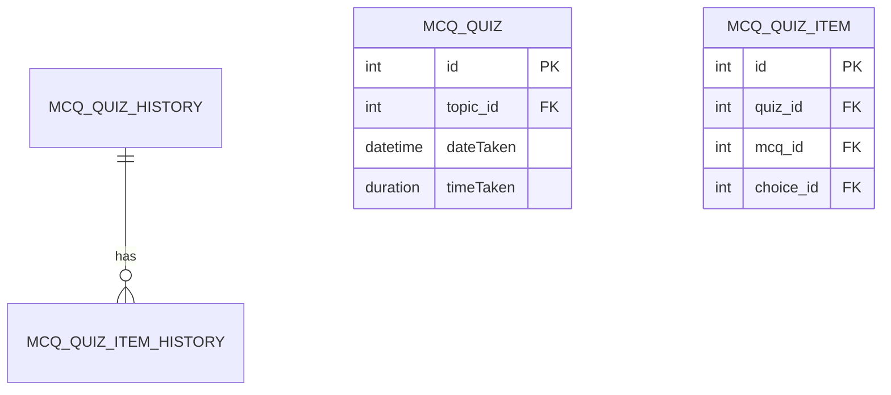

### CREATING THE QUIZ ERD

```mermaid
erDiagram
  MCQ_QUIZ_HISTORY ||--O{ MCQ_QUIZ_ITEM_HISTORY : has

  MCQ_QUIZ {
    int id PK
    int topic_id FK
    datetime dateTaken 
    duration timeTaken
  }

  MCQ_QUIZ_ITEM {
    int id PK
    int quiz_id FK
    int mcq_id FK
    int choice_id FK
  }
```